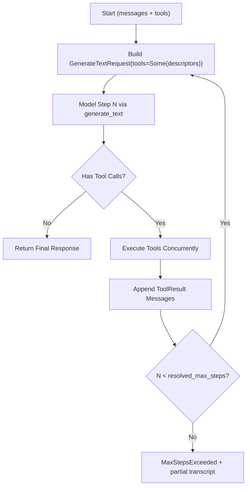

# 01 Architecture

## 1. 目标与职责
- 定义 SDK 的分层架构、模块边界和调用时序，作为实现硬约束。
- 明确 Core 与 Provider Adapter 的职责，避免接口重叠。
- 固化“单次生成”和“工具循环”两条路径的边界。

目标分层：
1. Public API Layer（`client`, `types`, `tool`）。
2. Core Orchestration Layer（request pipeline、retry、tool loop）。
3. Provider Adapter Layer（`openai`, `anthropic`）。
4. Transport/Streaming Layer（`reqwest`、SSE parser）。
5. Framework Adapter Layer（`axum_sse`，可选 feature）。

## 2. Public API/类型签名（最终形态）
对外导出：
```rust
pub use crate::client::{AiClient, AiClientBuilder};
pub use crate::types::{
    ProviderKind, ModelRef, Message, MessageRole, GenerateTextRequest, GenerateTextResponse,
    StreamEvent, TextStream, RunToolsRequest, RunToolsResponse,
};
pub use crate::tool::{ToolDescriptor, Tool, ToolExecutor, ToolRegistry};
pub use crate::error::{AiError, AiErrorCode};
```

内部 adapter 契约：
```rust
#[async_trait]
pub(crate) trait ProviderAdapter: Send + Sync {
    async fn generate_text(&self, req: &GenerateTextRequest) -> Result<GenerateTextResponse, AiError>;
    async fn stream_text(&self, req: &GenerateTextRequest) -> Result<TextStream, AiError>;
}
```

说明：
- 不再保留额外“工具步骤”方法；`run_tools` 内部循环统一复用 `generate_text`。
- 是否走工具模式由 `GenerateTextRequest.tools.is_some()` 决定。

## 3. 输入输出与数据流
标准非流式流程（`generate_text`）：
1. `AiClient` 接收 `GenerateTextRequest`。
2. 按 `ProviderKind` 选择 `ProviderAdapter`。
3. Adapter 映射统一类型到 provider payload。
4. 发送 HTTP 请求并归一化响应。

标准流式流程（`stream_text`）：
1. `AiClient` 接收 `GenerateTextRequest`。
2. Adapter 发起 provider 流请求。
3. SSE parser 解析 bytes 为统一 `StreamEvent`。
4. 返回 `TextStream`。

工具循环流程（`run_tools`）：


## 4. 核心算法/状态机（含伪代码）
请求管线状态：
```text
ValidateRequest -> SelectProvider -> ExecuteTransport -> NormalizeResponse -> Return
```

伪代码：
```text
fn dispatch(req):
    validate(req)?
    adapter = adapter_for(req.model.provider)?
    for attempt in 0..=max_retries:
        resp = adapter.call(req)
        match resp:
            Ok(v) => return Ok(v)
            Err(e) if retryable(e) && attempt < max_retries => backoff(attempt)
            Err(e) => return Err(e)
```

## 5. 边界条件与失败模式
- 边界：
- `run_tools` 必须受 `max_steps` 约束，禁止无限循环。
- Adapter 不允许依赖 `axum_sse`。
- Provider Adapter 只处理协议映射，不执行工具。

- 失败模式：
- Provider 返回未知字段导致反序列化失败。
- 流事件序列非法（`Done` 后仍有事件）。
- Core 与 Adapter 重试判定不一致。

## 6. 错误码与错误映射
分层映射原则：
- Transport 层错误 -> `Transport` / `Timeout`。
- HTTP 状态码：
- 401/403 -> `AuthFailed`
- 429 -> `RateLimited`
- 500-599 或 529 -> `ProviderServerError`
- 4xx 其他 -> `InvalidRequest`
- SSE 协议错误 -> `StreamProtocol`
- 解析错误 -> `InvalidResponse`

## 7. 测试用例列表（成功/失败/边界）
- 成功：
- 两个 Provider 在统一 API 下返回一致类型结构。
- `generate_text(tools=Some(...))` 可返回 tool calls。
- 流式事件按预期序列输出。

- 失败：
- Adapter 选择失败（feature 未启用）返回明确错误。
- HTTP 429 触发重试并最终失败时 `retryable=true`。

- 边界：
- `max_retries=0` 不重试。
- 未配置 API key 时请求前失败，不发网络调用。

## 8. 与其他模块的依赖契约
- `03-client-api.md` 依赖本文件定义的调用路径。
- `04/05-provider-*.md` 必须实现本文件的 `ProviderAdapter` 契约。
- `06-streaming.md` 提供统一流事件解析行为。
- `12-tool-definition.md` 提供工具类型与 registry 契约。
- `08-error-handling.md` 提供 `retryable` 判定规则。
- `09-axum-adapter.md` 只依赖统一 `StreamEvent`。

## 9. 非目标与后续扩展点
- 非目标：
- 当前不引入运行时插件加载。
- 当前不做批量请求编排。

- 扩展点：
- 新增 Provider 时只新增 Adapter 文件并注册路由。
- 增加 tracing middleware，不改变 Adapter 接口。
