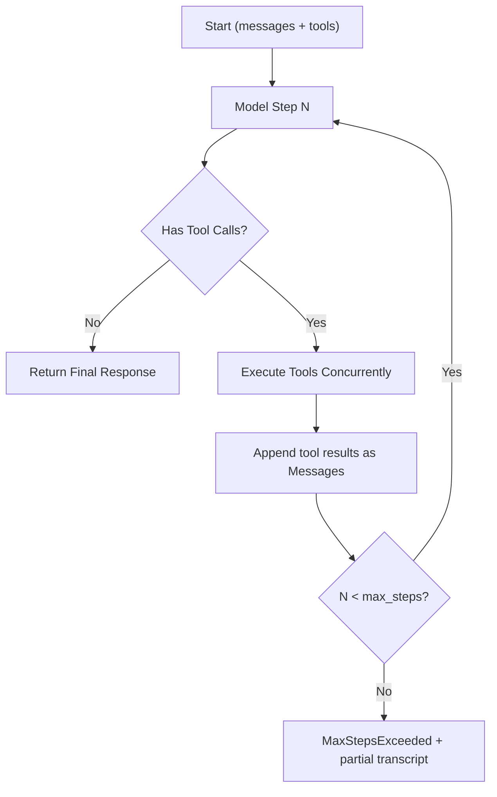

# 01 Architecture

## 1. 目标与职责
- 定义 SDK 的分层架构、模块边界和调用时序，作为实现的硬约束。
- 明确哪些逻辑属于 Core，哪些属于 Provider Adapter，避免耦合。
- 约束跨模块依赖方向，保证可测试性和可扩展性。

目标架构分层：
1. Public API Layer (`client`, `types`, `tool`)。
2. Core Orchestration Layer (`request pipeline`, `retry`, `tool loop`)。
3. Provider Adapter Layer (`openai`, `anthropic`)。
4. Transport/Streaming Layer (`reqwest`, SSE parser)。
5. Framework Adapter Layer (`axum_sse`, optional feature)。

## 2. Public API/类型签名（最终形态）
对外导出：
```rust
pub use crate::client::{AiClient, AiClientBuilder};
pub use crate::types::{
    ProviderKind, ModelRef, Message, MessageRole, GenerateTextRequest, GenerateTextResponse,
    StreamTextRequest, StreamEvent, TextStream, RunToolsRequest, RunToolsResponse,
};
pub use crate::tool::{ToolSpec, ToolExecutor};
pub use crate::error::{AiError, AiErrorCode};
```

内部契约：
```rust
#[async_trait]
pub(crate) trait ProviderAdapter: Send + Sync {
    async fn generate_text(&self, req: &GenerateTextRequest) -> Result<GenerateTextResponse, AiError>;
    async fn stream_text(&self, req: &GenerateTextRequest) -> Result<TextStream, AiError>;
    async fn generate_tool_step(&self, req: &GenerateTextRequest) -> Result<GenerateTextResponse, AiError>;
}
```

## 3. 输入输出与数据流
标准非流式流程（`generate_text`）：
1. `AiClient` 接收统一请求。
2. 路由到对应 `ProviderAdapter`。
3. Adapter 将统一类型映射为 Provider payload。
4. 发送 HTTP 请求并接收响应。
5. Adapter 反序列化并归一化为统一响应。

标准流式流程（`stream_text`）：
1. `AiClient` 发起流请求并获得 bytes 流。
2. SSE parser 将 bytes -> frame。
3. Adapter 将 provider frame -> 统一 `StreamEvent`。
4. 返回 `TextStream` 给调用方消费。

工具循环流程（`run_tools`）：


## 4. 核心算法/状态机（含伪代码）
请求管线状态：
```text
ValidateRequest -> SelectProvider -> ExecuteTransport -> NormalizeResponse -> Return
```

伪代码：
```text
fn dispatch(req):
    validate(req)?
    adapter = adapter_for(req.model.provider)?
    for attempt in 0..=max_retries:
        resp = adapter.call(req)
        match resp:
            Ok(v) => return Ok(v)
            Err(e) if retryable(e) && attempt < max_retries => backoff(attempt)
            Err(e) => return Err(e)
```

## 5. 边界条件与失败模式
- 边界：
- 不允许 Adapter 直接依赖 `axum_sse`。
- `run_tools` 不允许无限循环，必须受 `max_steps` 约束。
- 失败模式：
- Provider 返回未知字段导致反序列化失败。
- 流事件序列非法（例如 `Done` 前缺失必要终止事件）。
- Core 与 Adapter 对错误可重试判断不一致。

## 6. 错误码与错误映射
分层映射原则：
- Transport 层错误 -> `Transport` / `Timeout`。
- HTTP 状态码：
- 401/403 -> `AuthFailed`
- 429 -> `RateLimited`
- 5xx -> `ProviderServerError`
- 4xx 其他 -> `InvalidRequest`
- SSE 协议错误 -> `StreamProtocol`
- 解析错误 -> `InvalidResponse`

## 7. 测试用例列表（成功/失败/边界）
- 成功：
- 两个 Provider 在统一 API 下返回一致类型结构。
- 流式事件按预期序列输出。
- 失败：
- Adapter 选择失败（未启用对应 feature）返回明确错误。
- HTTP 429 触发重试并最终失败时给出 `retryable=true`。
- 边界：
- `max_retries=0` 时不重试。
- 未配置 API Key 时在请求前失败，不发送网络调用。

## 8. 与其他模块的依赖契约
- `03-client-api.md` 依赖本文件定义的调用路径。
- `04/05-provider-*.md` 必须实现本文件的 Adapter 契约。
- `06-streaming.md` 提供统一流事件解析行为。
- `12-tool-definition.md` 提供工具定义与注册执行契约。
- `08-error-handling.md` 提供 `retryable` 判定规则。
- `09-axum-adapter.md` 只能依赖统一 `StreamEvent`，不可回依赖 Provider。

## 9. 非目标与后续扩展点
- 非目标：
- 当前不引入插件注册中心和运行时动态加载。
- 当前不做批量请求编排。
- 扩展点：
- 增加 Provider 时仅新增 Adapter 文件并注册路由。
- 支持 tracing middleware，不改变 Adapter 接口。
